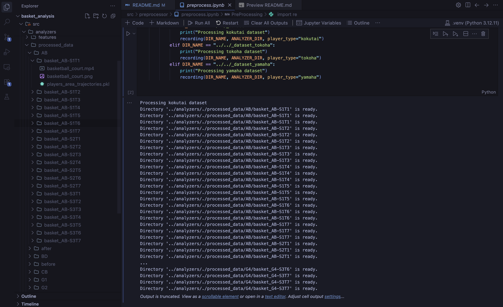

# 2025年度バスケットボール分析

## 更新履歴

- 2025/07/05：データの前処理のための計算過程を変更（該当箇所は [processors/voronoi_area.py](./src/processors/voronoi_area.py) 141行目から）
  - ボロノイ領域を有限範囲にクリップする際に**角を正しく処理していなかった問題**を修正
- 2025/07/09：クラスタリングをシルエット係数での評価付きで表示するように変更
- 2025/10/28：データ出力用ファイル（exporter_for_excel.ipynb）およびシルエットスコアグラフの出力用ファイル（plot_silhouette.ipynb）を追加．
  - 後者はAnalyzerに統合予定．
  - requirements.txtを更新
  - README.mdの更新
- 2026/03/02：リポジトリを更新
  - 変更点
    - 分析時のコードをanalyzersに移動
    - 分析時の入力値をnp.ndarray形式での入力に統一
- 2026/03/28：前処理パイプラインの高速化
  - Voronoi計算の重複排除、joblibによる並列処理（8並列）を導入
  - 前処理時間を1時間以上から**約10分**に短縮
- 2026/03/29：コート座標と動画表示の改善
  - コート座標をFIBA 3x3標準に修正（3Pライン・ペイントエリア・アーク・フリースローサークル）
  - ボロノイ動画に経過時間（秒）を表示するよう変更
  - 動画の再生速度を実時間に合わせて調整（fps=20, interval=50ms）
  - 動画ファイル名を `{ゲーム名}_voronoi.mp4` に変更
- 2026/04/01：ボロノイ領域の時系列変化グラフを追加
  - 試合単位で6選手のボロノイ領域面積の折れ線グラフを出力（3×3グリッド、セッション単位）
  - イベントデータからNo.3 (pink)の最初のcatchフレームに○マーカーを表示
  - 4ゲーム×3セッション＝計12画像を生成

## ======== 1. 環境設定 ========

本リポジトリは**MacOS**および**Windows 11**，**Python 3.12**での動作を確認しています．

### 1.1 Pythonパッケージのインストール

- 以下のコマンドを実行しpythonパッケージのインストールを行います．

```bash
# python >= 3.12
pip install -r requirements.txt
```

MacOSでの環境をそのままfreezeしただけなので使用環境に合わせてインストールできないものがあるかもしれませんが，適宜対応してください．

---

### 1.2 その他パッケージのインストール

- データの前処理にて**ffmpegを使用するためOSに合わせたインストールが必要**となります．

---

### 1.3 データの前処理

- データの前処理用ファイル **src/preprocessor/preprocess.ipynb** を全て実行しデータの前処理を行ってください．
  - 生データは **\_dataset...** ディレクトリに含まれています．
  - **src/analyzers/processed_data** ディレクトリが生成され，各マッチ，各ゲーム毎にディレクトリが生成されていれば成功です．
  - 前処理の実行には映像データへの加工が含まれるため，**約10分**かかります（joblib並列処理により高速化済み）．

---

## ======== 2. ファイル構成 ========

### 2.1 実行用ファイル

- \_dataset：国体データセット
- \_dataset_tokoha：常葉大学データセット
- \_dataset_yamaha：静岡大学データセット
- src：
  - analyzers：分析時実行コード
    - calculator.py：共通する計算処理系
    - datamanager.py：前処理したデータを取り出すためのコード
    - utils.py：共通するユーティリティ関数
    - clustering：クラスタリング分析
    - cross_correlation：相互相関分析
    - features：特徴量抽出
    - t_test：t検定
    - trajectory：軌跡分析
  - preprocessor：データ前処理用コード
    - courts：コート設計用コード
    - processors：ボロノイ領域の算出など
    - visualizers：映像化や可視化用コード
- README.md：説明用ファイル
- requirements.txt：必要パッケージ一覧

実行用ファイルは一貫して **analyzers/\*\*/main.ipynb** にしてあります．

### 2.2 分析用ディレクトリ

- clustering：クラスタリング分析
- cross_correlation：相互相関分析
- features：特徴量抽出
- t_test：t検定
- trajectory：軌跡分析

以上の5つのディレクトリはデータ分析用に作成されたものです．
内容物は以下の3つのファイルから構成されています．

- main.ipynb：分析時実行コード
- stats.py：統計量算出用コード
- drawer.py：分析結果描画処理用コード

drawer.py内でstats.py内で定義された統計量を用いて描画処理を行います．
したがって算出方法の変更や統計値を直接用いた処理（例えばExcelへの出力など）はstats.pyを編集することで可能となります．

対して描画方法の変更はdrawer.pyを編集することで可能となり，グラフの色や凡例，ラベルなどの表示内容を変更する場合はdrawer.pyを編集してください．

## ======== 3. 機能に関して ========

各種分析に使用するソースコードは **src/analyzers/\*\*** 内に保存されています．

- drawer.py：分析結果描画処理用コード（描画時に必要な計算処理も内部で行います）
- main.ipynb：分析時実行コード（preprocessing済みのデータがある場合に使用できる）
- stats.py：統計量算出用コード（drawer.py内で用いられる計算処理は主にここから）

分析項目を増やしたい場合は **src/analyzers** 内にディレクトリを新規作成し，**main.ipynb** と **stats.py** を追加してください．

## ======== 4. 使用パッケージ ========

- 相互相関係数の算出：https://matplotlib.org/stable/api/_as_gen/matplotlib.pyplot.xcorr.html

### 参考

- https://data-analysis-stats.jp/%E6%A9%9F%E6%A2%B0%E5%AD%A6%E7%BF%92/dtwdynamic-time-warping%E5%8B%95%E7%9A%84%E6%99%82%E9%96%93%E4%BC%B8%E7%B8%AE%E6%B3%95/
- https://kgt-blog.com/tech-22/2481/

## ======== 5. 動作例 ========

- 実際の動作は以下の通りです．（MacOS環境）

### 5.1 前処理

**初回動作時は約10分かかります（映像データの前処理があるため）．**

- src/preprocessor/preprocess.ipynbを実行します．
  

図のように .ipynbファイルが実行されており，`processed_data`ディレクトリが生成され最下層のディレクトリに以下の3つが生成されていれば成功です．

- {ゲーム名}_voronoi.mp4：ボールコート上のボロノイ領域の映像（経過時間表示付き，実時間再生）
- basketball_court.png：ボールコートにプレイヤーの移動を重ねた画像
- players_area_trajectories.pkl：各プレイヤーのボロノイ領域の変動データ（datamanager.pyで読み取るファイル）．データは階層化された辞書型のデータになっています．
  - Key：マッチ識別子（例：Aチーム対Bチーム（AB））
  - Value：
    - Key：ゲーム識別子（例：セッション1ゲーム1（AB-S1T1））
    - Value：
      - Key：プレイヤー識別子（例：オフェンスの赤色のプレイヤ（O1red）
      - Value：np.ndarray